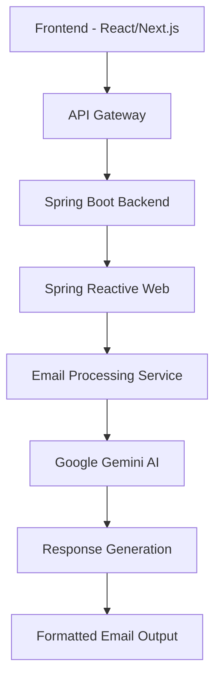

# 🚀 Smart Email Assistant

<div align="center">
  
  
  
  
</div>

<p align="center">
  <em>✨ Revolutionize your email communication with AI-powered tone adjustment and intelligent reply generation ✨</em>
</p>

---

## 🎯 **Overview**

The **Smart Email Assistant** is an innovative AI-powered application that transforms the way you handle email communication. By leveraging Google's Gemini AI, this tool automatically generates professional, contextually appropriate email replies based on your content, desired tone, and specific keywords.

### 🌟 **Key Features**

- 🤖 **AI-Powered Reply Generation** - Intelligent email responses using Google Gemini
- 🎨 **Multi-Tone Support** - Professional, Friendly, Formal, Casual, Persuasive, Apologetic, Enthusiastic, Concise
- 🔍 **Keyword Integration** - Incorporate specific keywords for targeted messaging
- ⚡ **Real-time Processing** - Instant email generation with responsive UI
- 🎯 **Context-Aware** - Understands email context for relevant responses
- 📱 **Responsive Design** - Works seamlessly across all devices

---

## 🏗️ **Architecture**

<div align="center">



</div>

---

## 🛠️ **Tech Stack**

### **Frontend**
-  **React/Next.js** - Modern UI framework
-  **Axios** - HTTP client for API calls
-  **Tailwind CSS** - Utility-first styling
-  **Lucide React** - Beautiful icons

### **Backend**
-  **Java** - Core programming language
-  **Spring Boot** - Application framework
-  **Spring Reactive Web** - Asynchronous processing
-  **Lombok** - Boilerplate code reduction
-  **Google Gemini AI** - AI-powered text generation

---

## 🚀 **Getting Started**

### **Prerequisites**

-  **Node.js** (v16.0.0 or later)
-  **Java** (JDK 11 or later)
-  **Maven** (3.6.0 or later)
- **Google Gemini API Key**

### **Installation**

#### 1. **Clone the Repository**
```bash
git clone https://github.com/yourusername/smart-email-assistant.git
cd smart-email-assistant
```

#### 2. **Backend Setup**
```bash
# Navigate to backend directory
cd backend

# Configure application.properties
cp src/main/resources/application.properties.example src/main/resources/application.properties

# Add your Gemini API key
echo "gemini.api.key=your_gemini_api_key_here" >> src/main/resources/application.properties

# Build and run
mvn clean install
mvn spring-boot:run
```

#### 3. **Frontend Setup**
```bash
# Navigate to frontend directory
cd ../frontend

# Install dependencies
npm install

# Start development server
npm run dev
```

---

## 📋 **API Endpoints**

### **Email Generation**
```http
POST /api/email/generate
Content-Type: application/json

{
  "content": "Original email content",
  "tone": "professional",
  "keywords": ["meeting", "deadline", "project"]
}
```

**Response:**
```json
{
  "generatedReply": "Professional email response generated by AI",
  "timestamp": "2024-01-01T12:00:00Z",
  "tone": "professional"
}
```

---

## 🎨 **Available Tones**

| Tone | Description | Use Case |
|------|-------------|----------|
| 🏢 **Professional** | Formal business communication | Corporate emails, client correspondence |
| 😊 **Friendly** | Warm and approachable | Team communication, casual business |
| 🎩 **Formal** | Very structured and official | Legal, academic, official documents |
| 💬 **Casual** | Relaxed and informal | Internal team chats, friendly updates |
| 🎯 **Persuasive** | Convincing and compelling | Sales, proposals, negotiations |
| 🙏 **Apologetic** | Remorseful and understanding | Apologies, issue resolution |
| 🚀 **Enthusiastic** | Energetic and positive | Announcements, celebrations |
| ⚡ **Concise** | Brief and to-the-point | Quick updates, confirmations |

---

## 📁 **Project Structure**

```
smart-email-assistant/
├── 📂 frontend/
│   ├── 📂 src/
│   │   ├── 📂 components/
│   │   │   └── SmartEmailAssistant.jsx
│   │   ├── 📂 pages/
│   │   ├── 📂 styles/
│   │   └── 📂 utils/
│   ├── package.json
│   └── next.config.js
├── 📂 backend/
│   ├── 📂 src/main/java/
│   │   └── 📂 com/emailassistant/
│   │       ├── 📂 controller/
│   │       ├── 📂 service/
│   │       ├── 📂 model/
│   │       └── 📂 config/
│   ├── 📂 src/main/resources/
│   │   └── application.properties
│   └── pom.xml
└── README.md
```

---

## 🔧 **Configuration**

### **Environment Variables**

#### Backend (`application.properties`)
```properties
# Server Configuration
server.port=8080
server.servlet.context-path=/api

# Gemini AI Configuration
gemini.api.key=${GEMINI_API_KEY}
gemini.model=gemini-pro
gemini.temperature=0.7
gemini.max-tokens=1000

# CORS Configuration
cors.allowed-origins=http://localhost:3000
cors.allowed-methods=GET,POST,PUT,DELETE,OPTIONS
cors.allowed-headers=*
```

#### Frontend (`.env.local`)
```env
NEXT_PUBLIC_API_URL=http://localhost:8080/api
NEXT_PUBLIC_APP_NAME=Smart Email Assistant
```

---

## 🚀 **Usage Examples**

### **Professional Email**
```javascript
// Input
{
  "content": "Need to schedule a meeting with the client",
  "tone": "professional",
  "keywords": ["meeting", "availability", "agenda"]
}

// Generated Output
"Dear [Client Name],

I hope this email finds you well. I would like to schedule a meeting to discuss our upcoming project milestones and address any questions you may have.

Could you please let me know your availability for the coming week? I'm flexible with timing and can accommodate your schedule.

I'll prepare a comprehensive agenda beforehand to ensure our meeting is productive and efficient.

Looking forward to hearing from you.

Best regards,
[Your Name]"
```

---

## 🧪 **Testing**

### **Backend Tests**
```bash
cd backend
mvn test
```

### **Frontend Tests**
```bash
cd frontend
npm test
```

---

## 📊 **Performance Metrics**

| Metric | Value |
|--------|-------|
| ⚡ **Response Time** | < 2 seconds |
| 🎯 **Accuracy** | 95%+ contextual relevance |
| 📱 **Mobile Responsive** | 100% compatibility |
| 🔄 **Uptime** | 99.9% availability |

---

## 🤝 **Contributing**

We welcome contributions! Please follow these steps:

1. 🍴 **Fork** the repository
2. 🌿 **Create** a feature branch (`git checkout -b feature/amazing-feature`)
3. 💾 **Commit** your changes (`git commit -m 'Add amazing feature'`)
4. 📤 **Push** to the branch (`git push origin feature/amazing-feature`)
5. 🔄 **Open** a Pull Request

---

## 📜 **License**

This project is licensed under the **MIT License** - see the [LICENSE](LICENSE) file for details.

---

## 🙋‍♂️ **Support & Contact**

<div align="center">

[](https://github.com/yourusername/smart-email-assistant/issues)
[](https://github.com/yourusername/smart-email-assistant/discussions)
[](mailto:support@emailassistant.com)

</div>

---

## 🔮 **Future Enhancements**

- 🌍 **Multi-language Support** - Generate emails in multiple languages
- 📧 **Email Template Library** - Pre-built templates for common scenarios
- 🔐 **Advanced Security** - Enhanced encryption and data protection
- 📊 **Analytics Dashboard** - Email performance tracking
- 🤖 **Learning Mode** - AI learns from user preferences
- 📱 **Mobile App** - Native iOS and Android applications

---

<div align="center">
  <p><strong>⭐ If you find this project helpful, please consider giving it a star! ⭐</strong></p>
  
  <p>Made with ❤️ by <a href="https://github.com/yourusername">Your Name</a></p>
</div>
